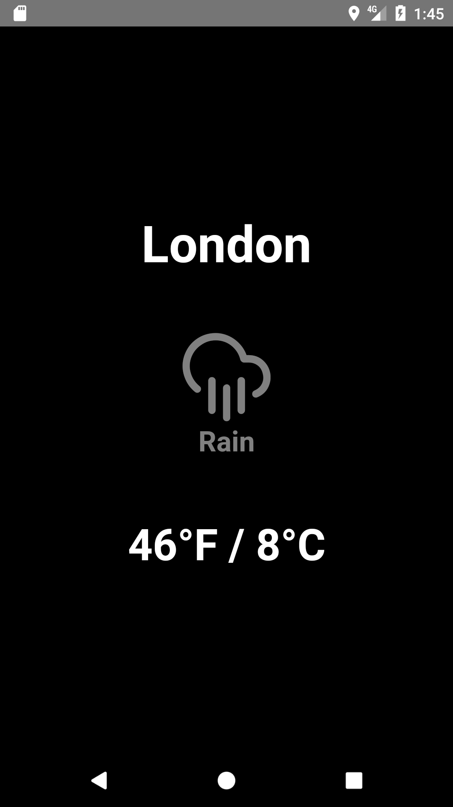

# Simple Weather

A simple weather app Tech.LA fellowships engineering challenge

## Setup and Run

    # Insert app id from https://openweathermap.org into ./src/credentials.json
    # Install dependencies and run
    yarn install
    react-native run-android